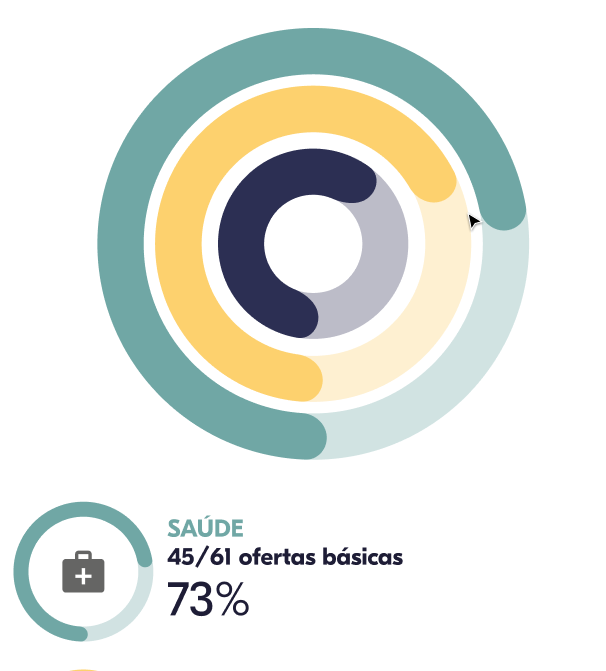

# Testes - Gráficos de Barra Circular (ou Gráficos radiais)

Cria exemplos de gráficos de barra circular baseado em diferentes tutoriais da internet utilizando CSS, SVG e o mínino de JS possível.

## Requisitos

Os requisitos são:

* Deve ser possível sobrepor gráficos para colocar uma barra dentro da outra;
* Deve ser possível criar o gráfico em diferentes tamanhos;
* As bordas da linha do gráfico devem ser arredondadas;
* Deve ser possível animar o gráfico.

A imagem abaixo exemplifica estes requisitos:

## Para Aprofundar

* Organizar os exemplos com comentários e criar um exemplo meu atendendo os requisitos claramente;
* [Criação do gráfico como um componente React](https://blog.logrocket.com/build-svg-circular-progress-component-react-hooks/);
* [Lib JS específica para riar esse tipo de gráfico com muitas customizações](https://tomik23.github.io/circular-progress-bar/)